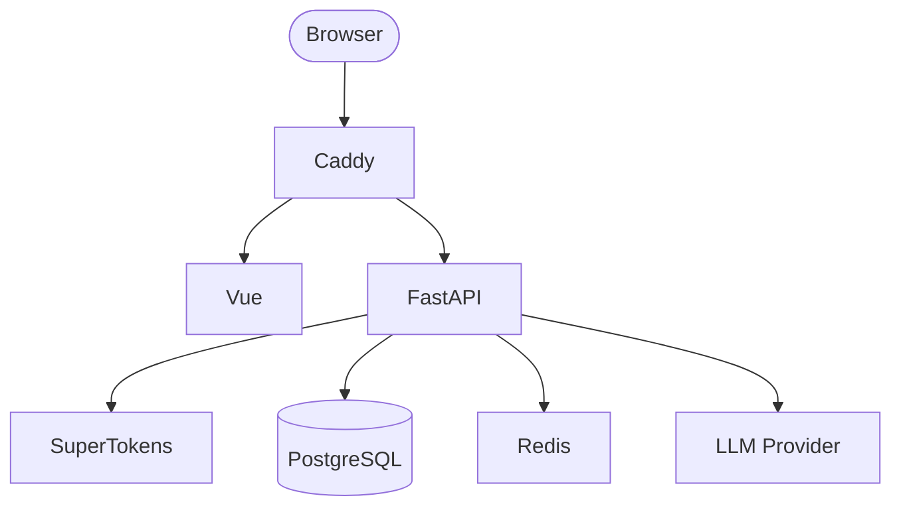

# AI Chat

## Technologies

| Area               | Technology                 |
| ------------------ | -------------------------- |
| Back-End           | FastAPI, Python            |
| Front-End          | Vue 3, Vite, TypeScript    |
| UI                 | PrimeVue 4, TailwindCSS V4 |
| Authentication     | SuperTokens                |
| Database           | PostgreSQL, SQLAlchemy     |
| Package Management | uv, pnpm                   |
| Containerization   | Docker Compose, Docker     |
| Reverse Proxy      | Caddy                      |

## Topology

## Getting Started

## Features

### Authentication

