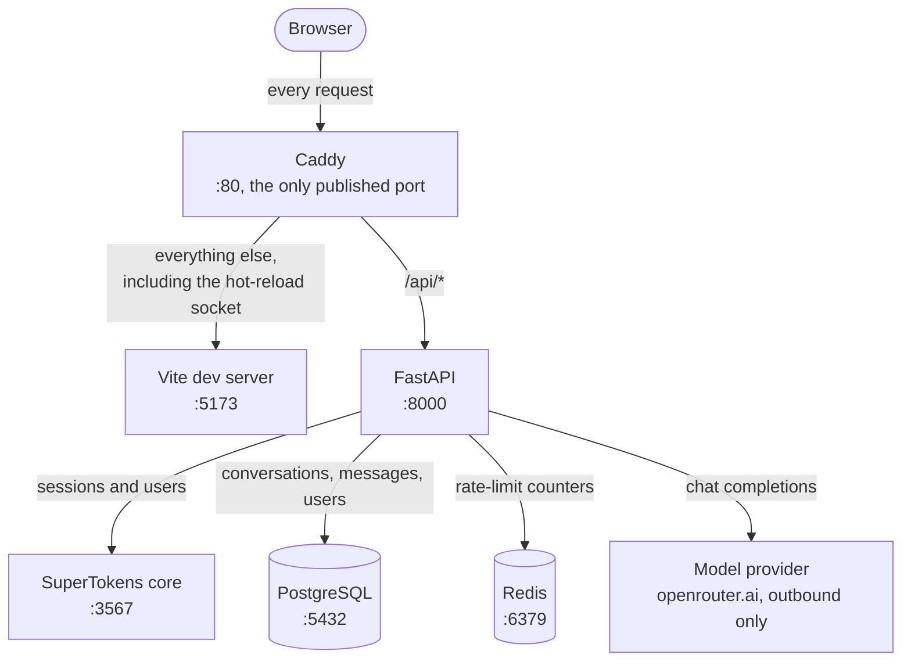

# AI Chat


A ChatGPT-style assistant with document retrieval, tool calling, and custom
skills.

## Contents

- [Technologies](#technologies)
- [System Topology](#system-topology)
  - [Development](#development)
- [Getting Started](#getting-started)
  - [OAuth redirect URIs](#oauth-redirect-uris)
- [Features](#features)
  - [Authentication](#authentication)

## Technologies

| Area               | Technology                 |
| ------------------ | -------------------------- |
| Back-End           | FastAPI, Python            |
| Front-End          | Vue 3, Vite, TypeScript    |
| UI                 | PrimeVue 4, TailwindCSS V4 |
| Authentication     | SuperTokens                |
| Database           | PostgreSQL, SQLAlchemy     |
| Package Management | uv, pnpm                   |
| Containerization   | Docker Compose, Docker     |
| Reverse Proxy      | Caddy                      |

## System Topology

The application is a single origin: the browser only ever talks to Caddy, which
routes `/api/*` to the API and everything else to the front end. Only Caddy
publishes a host port; every other service is reachable on the internal network
alone.

### Development

`just development` runs this from `infrastructure/docker/compose.yaml`, with the
SPA served by the Vite dev server so edits appear without a rebuild.



Postgres and Redis are drawn with their default in-container ports. Redis holds
rate-limit counters only and has no volume, so nothing there survives a restart.

**Loading a page.** The browser asks Caddy for a URL. Caddy sends anything under
`/api/` to the API and everything else to the dev server, which returns the SPA
shell and its modules. The SPA then calls `/api/...` on its own origin, so there
is no cross-origin request and no CORS configuration to keep in step.

**Sending a message.** The SPA posts to `/api/v1/conversations/...` through
Caddy. The API checks the session with SuperTokens, records the message in
Postgres, and streams the reply from the model provider back through Caddy to
the browser. The reply is streamed rather than buffered, which is why Caddy
leaves proxied responses alone for that route.

Running the API and the SPA on the host instead (`just back-end` /
`just front-end`) drops Caddy from the path: Vite serves the SPA on `:5173` and
proxies `/api` to the API on `:8000` itself. The end-to-end suite uses that
arrangement so it can supply its own model provider (ADR-0023).

## Getting Started

```sh
git clone <repo> && cd ai-chat
just install
just development
```

Then open <http://localhost>. That runs the whole stack in Compose — Postgres,
SuperTokens, Redis, the API, the Vite dev server, and Caddy in front of both.

```sh
just development-logs     # follow output in another terminal
just development-stop
```

There is nothing to configure for local use and no certificate to trust: the
development origin is plain HTTP (ADR-0025). The two template files are only
needed to change a default:

| Copy                                 | To                           | For                                                                                           |
| ------------------------------------ | ---------------------------- | --------------------------------------------------------------------------------------------- |
| `back-end/.env.example`              | `back-end/.env`              | the API's own settings — an LLM key for real replies, or OAuth credentials for social sign-in |
| `infrastructure/docker/.env.example` | `infrastructure/docker/.env` | the Docker setup — database password, published ports                                         |

The development stack loads `back-end/.env` too, so a credential added there is
picked up whether the API runs in the container or on the host. The Docker one
is optional: every value in it has a working default.

`just dependencies` brings up just the datastores, and `just back-end` /
`just front-end` run the API and SPA on the host — useful for debugging, and
what the e2e suite uses so it can supply its own mock provider (ADR-0023).

### OAuth redirect URIs

Social sign-in is configured per provider. Register the **SPA callback route**
with each provider — not `/api/auth/...`:

```
http://localhost/authentication/callback
```

The same URI serves every provider; providers distinguish by their own client
credentials, not by the path. It is the SPA route because the web SDK sends its
`frontendRedirectURI` as the provider's redirect URI, and the app does not pass
`redirectURIOnProviderDashboard` to override that. The provider sends the browser
back to this page, which hands the authorization code to SuperTokens' backend to
exchange.

Two consequences worth knowing:

- **`/api/auth/callback/{provider}` must not be registered.** That path is part
  of SuperTokens' API, and it is the redirect target only when the app passes
  `redirectURIOnProviderDashboard` explicitly. Registering it produces a sign-in
  that fails at the provider with a redirect-URI mismatch.
- **Nothing else needs to match.** The SPA route is about where the browser
  lands, so it is the same for Google and GitHub.

Development and production entries coexist; Google permits up to 100 redirect
URIs per client.

## Features

### Authentication


