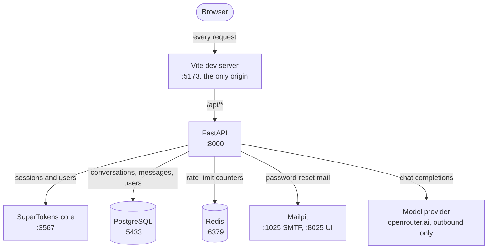
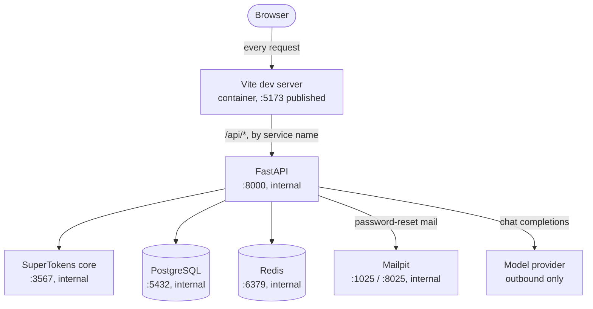
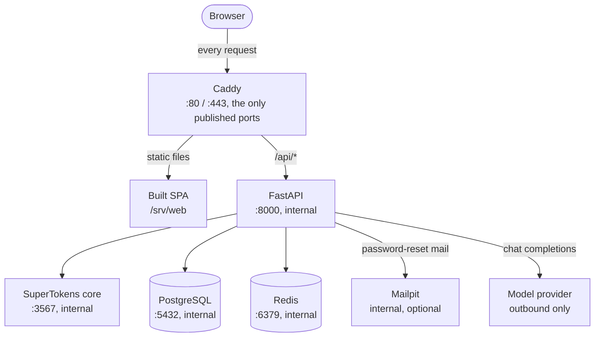

# AI Chat


A web-based AI chat interface.

## Contents

- [Technologies](#technologies)
- [System Topology](#system-topology)
  - [Development](#development)
  - [Containerized Development](#containerized-development)
  - [Self-Hosted](#self-hosted)
  - [Infrastructure-as-a-Service](#infrastructure-as-a-service)
- [Getting Started](#getting-started)
  - [OAuth redirect URIs](#oauth-redirect-uris)
- [Releasing](#releasing)
- [Features](#features)
  - [Authentication](#authentication)

## Technologies

| Area               | Technology                 |
| ------------------ | -------------------------- |
| Back-End           | FastAPI, Python            |
| Front-End          | Vue 3, Vite, TypeScript    |
| UI                 | PrimeVue 4, TailwindCSS V4 |
| Authentication     | SuperTokens                |
| Database           | PostgreSQL, SQLAlchemy     |
| Package Management | uv, pnpm                   |
| Containerization   | Docker Compose, Docker     |
| Reverse Proxy      | Caddy                      |

## System Topology

The application is a single origin: the browser only ever talks to one address,
which serves the SPA and answers `/api/*`. What provides that address differs per
setup — Vite's dev proxy in development, Caddy when self-hosted — but the
application does not know the difference.

### Development

`just development` is the normal loop. It starts the datastores in Compose
(PostgreSQL, SuperTokens, Redis, and Mailpit) and runs the API and the SPA on the
host. The browser opens the Vite dev server, and Vite proxies `/api` to the API,
so there is no reverse proxy and no cross-origin request.



Notice: the browser only ever loads `:5173`. The API's `:8000` and the datastore
ports exist for the host processes; none of them is the browser's origin.

**Loading a page.** The browser asks Vite for a URL. Vite returns the SPA shell
and its modules, and proxies anything under `/api/` to the API. The SPA then
calls `/api/...` on its own origin, so there is no CORS to keep in step.

**Sending a message.** The SPA posts to `/api/v1/conversations/...` through Vite.
The API checks the session with SuperTokens, records the message in Postgres, and
streams the reply from the model provider back to the browser through Vite.

Redis holds rate-limit counters only and has no volume, so nothing there survives
a restart. Mailpit catches development mail so no message leaves the machine
(ADR-0030).

### Containerized Development

`just development-containerized` runs the same setup entirely in Compose, from
`infrastructure/docker/compose.dev.yaml`. There is still no reverse proxy: Vite's
container publishes `:5173` (the origin) and proxies `/api` to the `api` service.



Notice: the browser path is identical to the native lane. Only the API and the
datastores move inside the compose network.

### Self-Hosted

`just self-host` runs `infrastructure/docker/compose.selfhost.yaml`: the built SPA
and the API's own image, with Caddy as the front door. Caddy serves the built
files and proxies `/api` to the API, and it is the only service that publishes a
host port. This is the production shape.



Notice: no service but Caddy is reachable from outside. Set `SITE_ADDRESS` to a
real domain and Caddy obtains a TLS certificate automatically; the default is a
local plain-HTTP smoke test.

### Infrastructure-as-a-Service

_Not yet written._

## Getting Started

```sh
git clone <repo> && cd ai-chat
just install
just development
```

Then open <http://localhost:5173>. This starts the datastores in Compose and runs
the API and the SPA on the host; Vite serves the app and proxies `/api` to the
API. To run everything in containers instead, use
`just development-containerized` and open the same address.

```sh
just development-logs     # follow the datastore output
just development-stop
```

There is nothing to configure for local use and no certificate to trust: the
development origin is plain HTTP on a port (ADR-0046). The two template files are
only needed to change a default:

| Copy                                 | To                           | For                                                                                           |
| ------------------------------------ | ---------------------------- | --------------------------------------------------------------------------------------------- |
| `back-end/.env.example`              | `back-end/.env`              | the API's own settings — an LLM key for real replies, or OAuth credentials for social sign-in |
| `infrastructure/docker/.env.example` | `infrastructure/docker/.env` | the Compose files — database password, published ports, and the self-hosted address            |

The containerized development stack loads `back-end/.env` too, so a credential
added there is picked up whether the API runs in the container or on the host.
The Docker one is optional: every value in it has a working default.

`just dependencies` brings up just the datastores, and `just back-end` /
`just front-end` run the API and the SPA individually — useful for debugging. The
end-to-end suite uses its own stack; run it with `just test-e2e`.

### OAuth redirect URIs

Social sign-in is configured per provider. Register the **SPA callback route**
with each provider — not `/api/auth/...`. Because the browser origin is the Vite
port in development and the Caddy address when self-hosted, register one per
origin:

```
http://localhost:5173/authentication/callback    # development
https://chat.example.com/authentication/callback # self-hosted (your domain)
```

The same path serves every provider; providers distinguish by their own client
credentials, not by the path. It is the SPA route because the web SDK sends its
`frontendRedirectURI` as the provider's redirect URI, and the app does not pass
`redirectURIOnProviderDashboard` to override that. The provider sends the browser
back to this page, which hands the authorization code to SuperTokens' backend to
exchange.

Three consequences worth knowing:

- **`/api/auth/callback/{provider}` must not be registered.** That path is part
  of SuperTokens' API, and it is the redirect target only when the app passes
  `redirectURIOnProviderDashboard` explicitly. Registering it produces a sign-in
  that fails at the provider with a redirect-URI mismatch.
- **The registered URL must carry no query string.** Google and GitHub both
  reject a `redirect_uri` that does not exactly match, so the app never appends
  a `?redirectTo=…` (or anything else) to this URL. That was a real bug: the
  post-sign-in destination used to ride on the callback URL and both providers
  refused with `redirect_uri_mismatch`. The destination is now remembered in
  the tab's `sessionStorage` and read back on the callback. It is a validated
  path, never a token.
- **Nothing else needs to match.** The SPA route is about where the browser
  lands, so it is the same for Google and GitHub.

Development and production entries coexist; Google permits up to 100 redirect
URIs per client.

## Releasing

Releases are automated with [`release-please`](https://github.com/googleapis/release-please).
Conventional commits merged to `main` update a **Release PR** that bumps the
version and writes `CHANGELOG.md`; merging that PR tags the commit (`vX.Y.Z`) and
publishes the GitHub Release. The full setup, including the optional
`RELEASE_PLEASE_TOKEN` secret, is documented in [`AGENTS.md`](./AGENTS.md).

## Features

### Authentication


