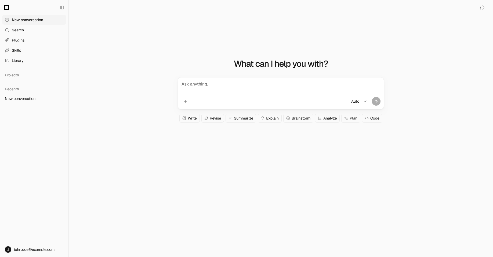
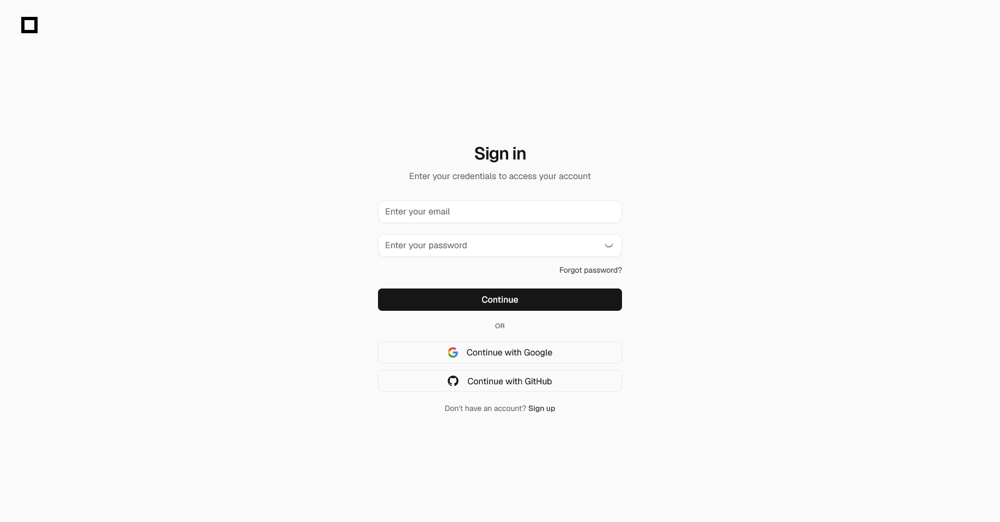

# AI Chat



## Technologies

| Area               | Technology                 |
| ------------------ | -------------------------- |
| Back-End           | FastAPI, Python            |
| Front-End          | Vue 3, Vite, TypeScript    |
| UI                 | PrimeVue 4, TailwindCSS V4 |
| Authentication     | SuperTokens                |
| Database           | PostgreSQL, SQLAlchemy     |
| Package Management | uv, pnpm                   |
| Containerization   | Docker Compose, Docker     |
| Reverse Proxy      | Caddy                      |

## Topology


## Getting Started

```sh
git clone <repo> && cd ai-chat
just install
just development
```

Then open <http://localhost>. That runs the whole stack in Compose — Postgres,
SuperTokens, Redis, the API, the Vite dev server, and Caddy in front of both.

```sh
just development-logs     # follow output in another terminal
just development-stop
```

There is nothing to configure for local use and no certificate to trust: the
development origin is plain HTTP (ADR-0025). The two template files are only
needed to change a default:

| Copy | To | For |
|---|---|---|
| `back-end/.env.example` | `back-end/.env` | the API's own settings — an LLM key for real replies, or OAuth credentials for social sign-in |
| `infrastructure/docker/.env.example` | `infrastructure/docker/.env` | the Docker setup — database password, published ports |

The development stack loads `back-end/.env` too, so a credential added there is
picked up whether the API runs in the container or on the host. The Docker one
is optional: every value in it has a working default.

`just dependencies` brings up just the datastores, and `just back-end` /
`just front-end` run the API and SPA on the host — useful for debugging, and
what the e2e suite uses so it can supply its own mock provider (ADR-0023).

### OAuth redirect URIs

Social sign-in is configured per provider. Register the **SuperTokens** callback,
not an SPA route:

```
http://localhost/api/auth/callback/google
http://localhost/api/auth/callback/github
```

Development and production entries coexist; Google permits up to 100 redirect
URIs per client.

## Features

### Authentication


